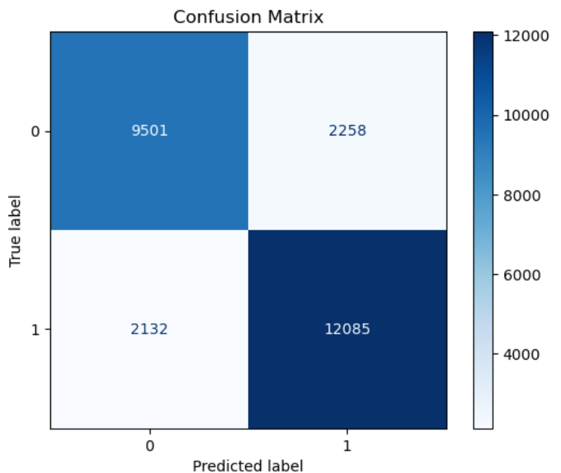
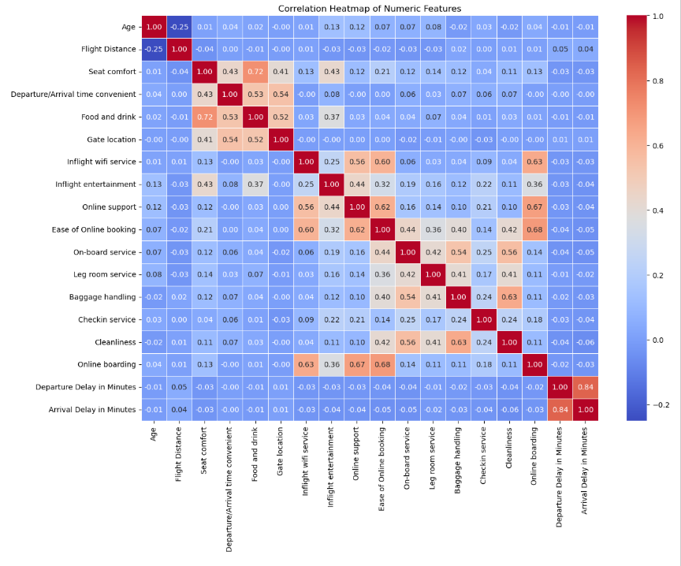

# ✈️ Airline Customer Satisfaction Prediction using Logistic Regression

## 📌 Project Overview
This project focuses on predicting whether an airline customer is **Satisfied** or **Dissatisfied** using machine learning.  
The objective is not only to build a predictive model, but also to understand **which factors most strongly influence customer satisfaction**.

The project demonstrates an end-to-end ML workflow including EDA, statistical feature selection, model building, evaluation, and interpretation.

---

## 🔍 Dataset Description
The dataset contains airline customer information such as:
- Demographic attributes (e.g., Age, Gender)
- Flight-related details (e.g., Class, Type of Travel, Flight Distance)
- Service quality ratings (e.g., Seat Comfort, Inflight Entertainment, Online Support)
- Operational metrics (e.g., Departure and Arrival Delays)

The **target variable** represents overall customer satisfaction (binary classification).

---

## 🧠 Methodology

### 1️⃣ Exploratory Data Analysis (EDA)
- Analyzed feature distributions
- Checked correlations between numeric variables
- Identified patterns influencing customer satisfaction

### 2️⃣ Feature Selection
- Since **all input features are numeric** and the target variable is categorical,  
  **ANOVA (F-test)** was applied for feature selection
- This helped identify statistically significant predictors of satisfaction

### 3️⃣ Data Preprocessing
- Defined features (`X`) and target (`y`)
- Scaled features using **StandardScaler**
- Performed train-test split

### 4️⃣ Model Building
- Implemented **Logistic Regression**
- Tuned hyperparameters using **GridSearchCV**
- Addressed class balance where applicable

### 5️⃣ Model Evaluation
- Confusion Matrix
- ROC Curve & ROC-AUC score
- Accuracy, Precision, Recall, and F1-score
- Threshold optimization using ROC analysis

### 6️⃣ Model Interpretation
- Analyzed Logistic Regression coefficients
- Identified direction and magnitude of feature impact on satisfaction

---

## 📊 Model Evaluation

### Confusion Matrix

### ROC Curve

### Class Imbalance

### Heatmap

---

## 📈 Performance Metrics
The model was evaluated using the following metrics:
- Accuracy
- Precision
- Recall
- F1-score
- ROC-AUC

These metrics ensured robust evaluation beyond accuracy alone, especially for classification performance.

---

## 🧠 Key Insights
- **Service quality features** such as *Inflight Entertainment*, *Seat Comfort*, *Online Support*, and *Ease of Online Booking* were the strongest drivers of customer satisfaction.
- **Digital experience** plays a critical role in shaping customer perception.
- **Operational delay features** (departure/arrival delays) showed comparatively lower influence than service-related features.
- Logistic Regression provided both strong performance and high interpretability.

---

## 🛠️ Technologies Used
- Python
- Pandas & NumPy
- Scikit-learn
- Matplotlib & Seaborn
- Jupyter Notebook

---

## 📂 Project Structure
airline-customer-satisfaction-ml/

├── notebooks/

│ └── airline_customer_satisfaction.ipynb

├── images/

│ ├── roc_curve.png

│ ├── confusion_matrix.png

├── dataset/

│ └── airline_data.csv

├── README.md

├── requirements.txt

└── .gitignore

---

## 🚀 How to Run the Project

1. Clone the repository - '''bash git clone https://github.com/atharva-2011/airline-customer-satisfaction-ml.git
2. Install Required Dependecies
3. Launch Jupyter Notebook
4. Open the notebook inside the notebooks/ folder and run all cells.

## 📈 Future Improvements

Compare Logistic Regression with ANN models
Apply SHAP for advanced model explainability
Deploy the model using Streamlit for interactive usage

## 👤 Author
### Atharva Ayachit
#### Aspiring Data Scientist | Data Analyst
